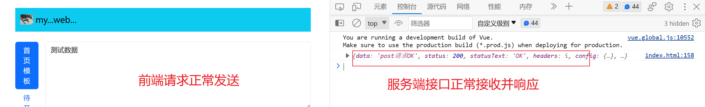

# 学习目标

 [马老师在线课堂-建议先两倍速学习一下](http://mayw.host3v.club/mageOnline/)

 [音乐播放器项目](http://mayw.host3v.club/music-jquery/)

 [马哥在线网站项目](http://mayw.host3v.club/mageOnline/)
 > [马哥在线网站PSD效果图](https://www.123pan.com/s/A7oDVv-DyY4H) 

---

# web项目搭建过程记录和扩展

## 项目描述

1. 全栈web网站：

   ​	项目 `webProject`目录下分别存放两个目录。一个前端项目`webFE`,一个服务端项目`server`。注意不能有中文目录。

2. 技术栈：html+css+js+bootstrap+vue+ajax(axios)+node.js+mysql

## 前端页面搭建

1. 创建目录文件

   1. `lib`: 存放前端项目所依赖的第三方库，例如`bootStrap`、`vue`、`axios`等
   2. `images `: 存放项目所需要的媒体文件

2. 编写`index.html`代码

   ```html
   <!DOCTYPE html>
   <html lang="en">
   <head>
       <meta charset="UTF-8">
       <meta name="viewport" content="width=device-width, initial-scale=1.0">
       <title>网站布局</title>
       <link rel="stylesheet" href="./lib/bootstrap.min.css">
       <script src="./lib/bootstrap.bundle.min.js"></script>
   </head>
   <body>
       <!-- 顶部 -->
       <div class="container-md container-lg container-xl mt-4">
           <nav class="navbar navbar-light bg-info  ">
               <div class="container-fluid">
                   <a class="navbar-brand" href="javascript:;">
                       
                       my...web...
                   </a>
               </div>
           </nav>
       </div>
       <!-- 主题内容 ： 卡片效果 -->
       <div class="container mt-4" id="app">
           <div class="d-flex align-items-start">
               <div class="nav flex-column nav-pills me-3" id="v-pills-tab" role="tablist" aria-orientation="vertical">
                   <button class="nav-link active" id="v-pills-home-tab" data-bs-toggle="pill"
                       data-bs-target="#v-pills-home" type="button" role="tab" aria-controls="v-pills-home"
                       aria-selected="true">首页模板</button>
                   <button class="nav-link" id="v-pills-profile-tab" data-bs-toggle="pill"
                       data-bs-target="#v-pills-profile" type="button" role="tab" aria-controls="v-pills-profile"
                       aria-selected="false">待开发1</button>
                   <button class="nav-link" id="v-pills-messages-tab" data-bs-toggle="pill"
                       data-bs-target="#v-pills-messages" type="button" role="tab" aria-controls="v-pills-messages"
                       aria-selected="false">待开发2</button>
                   <button class="nav-link" id="v-pills-settings-tab" data-bs-toggle="pill"
                       data-bs-target="#v-pills-settings" type="button" role="tab" aria-controls="v-pills-settings"
                       aria-selected="false">待开发3</button>
               </div>
               <div class="tab-content" id="v-pills-tabContent">
                   <div class="tab-pane fade show active" id="v-pills-home" role="tabpanel"
                       aria-labelledby="v-pills-home-tab">
   
                       <!-- 文本输入框 -->
                       <div class="mb-3">
                           <textarea class="form-control" rows="6" cols="130" 
                               placeholder="请输入内容...回车确认..."
                               ref="poemarea"
                               v-model="poem" 
                               v-on:keydown.enter="addPoem()"
                           ></textarea>
                       </div>
   
                   </div>
                   <div class="tab-pane fade" id="v-pills-profile" role="tabpanel" aria-labelledby="v-pills-profile-tab">
                       1111
                   </div>
                   <div class="tab-pane fade" id="v-pills-messages" role="tabpanel" aria-labelledby="v-pills-messages-tab">
                       222
                       <div>
                           <div class="tab-pane fade" id="v-pills-settings" role="tabpanel"
                               aria-labelledby="v-pills-settings-tab">
                               333
                           </div>
                       </div>
                   </div>
               </div>
           </div>
           <!-- 第一个模块的数据显示区域 -->
           <div class="container mt-4 mb-1" >
               <div class="card text-center mt-1">
                   <div class="card-body">
                       <p class="card-text">待获取服务端数据</p>
                   </div>
               </div>
           </div>
       </div>
   
       <!-- 准备一个盒子，撑开一块区间。为了不让底部固定的盒子遮挡上方数据 -->
       <div class="container " style="height: 140px;background-color: #fff;">
   
       </div>
       <!-- 底部 -->
       <div class="container-fluid fixed-bottom">
           <div class="card text-center">
               <div class="card-body">
                   <h5 class="card-title">暑期-快速搭建网站</h5>
                   <p class="card-text">html+css+bootstrap+javascript+ajax+axios+vue+node+mysql+python</p>
                   <a href="https://gitee.com/mayuanwei/summer-program" class="btn btn-primary">跳转惊喜...</a>
               </div>
           </div>
       </div>
   </body>
   </html>
   ```

   

---

## 创建数据库和表结构

​	

​	也可以使用sql语句创建

```sql
create database  IF NOT EXISTS summer;

use summer;

SET FOREIGN_KEY_CHECKS=0;

DROP TABLE IF EXISTS `summerweb`;
CREATE TABLE `summerweb` (
  `id` int NOT NULL AUTO_INCREMENT,
  `content` varchar(255) NOT NULL,
  PRIMARY KEY (`id`)
) ENGINE=InnoDB AUTO_INCREMENT=9 DEFAULT CHARSET=utf8mb4 COLLATE=utf8mb4_0900_ai_ci;


INSERT INTO `summerweb` VALUES ('1', '会当凌绝顶');
```

---

## 服务端项目`server`搭建

> 不能有中文目录

1. 在终端进入**项目目录**安装服务端开发所需要的第三方包。

   1. `express` ： 服务器软件容器

   2. `mysql` ： 操作数据库

   3.  `cors`： 解决跨域问题

      

      ```
      npm i express mysql cors
      ```

      

   4. 安装好后，项目目录会自动更新出文件和目录。

      

2. 编写服务端入口文件 `app.js`

   ```javascript
   // 导入express
   const express = require('express')
   // 导入mysql
   const mysql = require('mysql') 
   // 导入cors 
   const cors = require('cors') 
   const db = mysql.createPool({       // 建立与 MySQL 数据库的连接关系
       host: '127.0.0.1',                // 数据库的 IP 地址
       user: 'root',                     // 登录数据库的账号
       password: '123456',               // 登录数据库的密码
       database: 'summer',                 // 指定要操作哪个数据库
   })
   // 创建服务和端口
   const app = express()
   const port = 3000
   // 使用中间件解决跨域问题和body参数传递问题
   app.use(cors())
   app.use(express.urlencoded({ extended: false }))
   // 创建路由：前端通过xxx方式访问xxx地址。
   app.get('/poem',(req,res)=>{
       res.send('get请求OK')
   })
   
   app.post('/poem',(req,res)=>{
       res.send('get请求OK')
   })
   // 启动服务。监听端口
   app.listen(port, () => {
       console.log(`server...is...running...http://localhost/${port}`)
   })
   ```

   

3. 先启动服务，测试 `get` 接口是否可以使用

   1.  在`server` 目录下：输入命令启动项目 `node app.js`

      

   2. 利用浏览器地址栏默认发送get请求，来测试 get 接口是否成功

      

---

## 发送数据

1. 使用vue。给输入框绑定事件。在回车事件中，获取输入框内容并发送ajax请求给服务器。

   1. 引入vue文件和axios文件： 

      ```html
      <script src="https://unpkg.com/vue@3/dist/vue.global.js"></script>
      <!-- 使用ajax第三方在线包 axios -->
      <script src="https://unpkg.com/axios/dist/axios.min.js"></script>
      ```

   2. 创建vue对象代码

      ```javascript
      <script>
          const { createApp } = Vue
          const app = createApp({
              data(){
                  return {  
                  }
              } ,
      
              methods:{
              
              }
          })
          app.mount('#app')
      </script>
      ```

   3. 在页面上找到需要管理的模块。添加 `id="app"`

      ```html
          <!-- 主题内容 ： 卡片效果 -->
          <div class="container mt-4" id="app"  >
      		...
          </div>
      ```

   4. 给文本域进行数据的双向绑定和回车事件

      ```html
        <!-- 主题内容 ： 卡片效果 -->
          <div class="container mt-4" id="app"  >
      			...
                          <!-- 文本输入框 -->
                          <div class="mb-3">
                              <textarea class="form-control" rows="6" cols="130" 
                                  placeholder="请输入内容...回车确认..."
                                  ref="poemarea"
                                  v-model="poem" 
                                  v-on:keydown.enter="addPoem()"
                              ></textarea>
                          </div>
      			...
          </div>
      ```

   5. 编写vue代码

      ```javascript
      <script>
          const { createApp } = Vue
          const app = createApp({
              data() {
                  return {
                      // 双向数据绑定 
                      poem: ''
                  }
              },
      
              methods: {
                  // 发送请求 携带poem数据
                  addPoem() {
                      let that = this
                      // post请求注意按照如下格式。
                      axios.post('http://localhost:3000/poem', {
                          poem: that.poem
                      },
                          {
                              headers: {
                                  'Content-Type': 'application/x-www-form-urlencoded'
                              }
                          })
                          .then(function (response) {
                              console.log(response);
                          })
                  }
              }
          })
          app.mount('#app')
      </script>
      ```

   6. 测试功能。

      

      

2. 编写服务端接口。获取数据。操作数据库

   ```javascript
   app.post('/poem',(req,res)=>{
       //接受传递过来的数据 
       let poem = req.body.poem
       // 操作数据库
       // 1. 将需要往数据库插入的数据，包装成对象 。重点：键名和数据库表中的字段保持一直。
       let poemData = {content: poem}
       //2. 编写sql语句
       let sqlStr = 'insert into summerWeb set ?'
       //3. 执行 SQL 语句
       db.query(sqlStr, poemData, (err, results) => {
           if (err) return console.log(err.message,'数据库插入数据失败')
           if (results.affectedRows === 1) {
               res.send(`存储成功poem`)
           }
       })	
   ```

3. 优化前端发送请求后页面效果：清空输入框和输入框失去焦点

   1. 给输入框添加属性 `ref="poemarea"`

      ```html
         <!-- 文本输入框 -->
                          <div class="mb-3">
                              <textarea class="form-control" rows="6" cols="130" placeholder="请输入内容...回车确认..." 
                              ref="poemarea"  v-model="poem" v-on:keydown.enter="addPoem()"></textarea>
                          </div>
      ```

   2. vue中修改代码

      ```javascript
      // 发送请求 携带poem数据
                  addPoem() {
                      let that = this
                      // post请求注意按照如下格式。
                      axios.post('http://localhost:3000/poem', {
                          poem: that.poem
                      },
                          {
                              headers: {
                                  'Content-Type': 'application/x-www-form-urlencoded'
                              }
                          })
                          .then(function (response) {
                              console.log(response);
                          })
                      this.poem = ''
                      this.$refs.poemarea.blur()
                  }
      ```

---


##  获取数据

>  页面加载就发送`get`请求。获取数据库数据展示到页面上。

1. 页面初始化方法调用`get`请求的方法

   ```javascript
       const { createApp } = Vue
       const app = createApp({
   		...
           methods: {
               // 发送请求 携带poem数据
               addPoem() {
                  ...
               },
               // 获取数据的方法
               getPoem(){
                   // 待编写代码
               }
           },
   
           // 页面一加载就执行的函数
           mounted(){
               this.getPoem()
           }
       })
       app.mount('#app')
   ```

2. 发送请求。获取数据

   ```javascript
       const { createApp } = Vue
       const app = createApp({
           data() {
               return {
                	...
                   // 声明一个数组，存放后端查询到的数据。方便在页面遍历
                   poemArr :[]
               }
           },
   
           methods: {
               // 发送请求 携带poem数据
               addPoem() {
                  ...
               },
               // 获取数据的方法
               getPoem(){
                   let that = this
                   // 访问服务器获取数据 : ajax技术。
                   axios.get('http://localhost:3000/poem')
                       .then(function (response) {
                           // 把response.data
                           that.poemArr=response.data
                       })
               }
           },
           // 页面一加载就执行的函数
           mounted(){
               this.getPoem()
           }
       })
       app.mount('#app')
   ```

3. 将 poemArr数组中数据，遍历到页面

   ```html
       <!-- 主题内容 ： 卡片效果 -->
       <div class="container mt-4" id="app">
   		...
           <!-- 第一个模块的数据显示区域 -->
           <div class="container mt-4 mb-1" v-for="item in poemArr">
               <div class="card text-center mt-1">
                   <div class="card-body">
                       <p class="card-text">{{item.content}}</p>
                   </div>
               </div>
           </div>
       </div>
   ```

## 效果演示


---

# 在线文档

  [bootstap中文文档](https://www.bootstrap.cn/doc/read/94) 

  [vue文档](https://cn.vuejs.org/)

  [express中文文档](https://nodejs.cn/express/starter/)

  [axios中文网](https://axios.nodejs.cn/docs/intro)


# 软件安装

[MySQL8 （安装版）教程](https://malaoshi.feishu.cn/docx/doxcn8yWT5lVNSPjbI18TSAHA9f)

[navicat安装步骤](https://malaoshi.feishu.cn/docx/doxcnCYDWKREgRhaBfQ3gu9xLWd)

[node安装步骤](https://malaoshi.feishu.cn/docx/N99sdLaPOoS1DVx9PqYclqRmnhc)

[各种软件安装与破解](https://www.yuque.com/myw/ruanjian)

---

# 编程知识在线笔记
[HTML笔记](https://www.yuque.com/myw/mps0hv)

[CSS笔记](https://www.yuque.com/myw/css)

[H5C3阶段](https://www.yuque.com/myw/di8gqh)

[JavaScript基础](https://www.yuque.com/myw/javascriptbasic)

[JavaScript-Web APIS](https://www.yuque.com/myw/hpkan9)

[JavaScript高级](https://www.yuque.com/myw/hpkan9)

[ajax](https://malaoshi.feishu.cn/drive/folder/fldcn09fMgibeWqEvCUpplfNpAh)


[bootStrap5框架](https://malaoshi.feishu.cn/drive/folder/fldcnnMfYzqc0yUCr6CIMq2AwQf)

[node](https://malaoshi.feishu.cn/drive/folder/fldcnoGTRNHim2vTzdmx3FSmInc)

[vue](https://malaoshi.feishu.cn/drive/folder/fldcniDngiRjKlgjf2rwLjBttwh)


[马老师笔记-多学科](https://www.yuque.com/myw)

---


# git协同用法
1. 安装git软件
2. 拉去项目到本地
  1. 找一个存放代码的目录。
  2. Cmd ： git clone https://gitee.com/mayuanwei/summer-program.git
  3. 拉去云平台代码到本地： git pull
  4. 创建自己代码目录，编写代码。
  5. 上传自己的代码到gitee。

        1.  标记当前目录代码已经被自己修改过了：git add .

            2. 查看项目状态（可以省略）： git status  可以看到有自己更新过文件，变绿色。
    
            3. 提交代码到本地仓库： git commit -m '注释内容解释说明这次提交的意义'。如果是首次提交，需要设置用户名和邮箱
    
            4. 推送本地仓库代码到云端：git push。此时云端发生改变。如果是首次提交，需要登录用户名和密码

---

## vue快速入门：服务于web动态网站
  ```html
     <!DOCTYPE html>
      <html lang="en">
          <head>
              <meta charset="UTF-8">
              <title>马老师讲前端</title>
          </head>
          <body>
              
              <div id="app">
                  {{ age }}

                  <textarea name="" id="" cols="30" rows="10" ref="area" v-model="content" 
                  v-on:keydown.enter="getTextareaCon()"></textarea>

                  <hr>
                  <ul>
                      <li v-for="item in arr">  {{item}} </li>
                  </ul>
              </div>
          
              <div id="box"></div>
          </body>
      </html>
      <script src="https://unpkg.com/vue@3/dist/vue.global.js"></script>

      <script>

      const { createApp } = Vue


      const app = createApp({
          data(){
              return {
                  age :39,
                  content :'',
                  arr : []
              }
          } ,

          methods:{
              getTextareaCon(e){
                this.arr.push(this.content) 
                console.log(this.arr)
                this.content = ''
                //让当前元素输入框，失去焦点
                this.$refs.area.blur()
              }
          }

      })

      app.mount('#app')

      </script>
  ```

